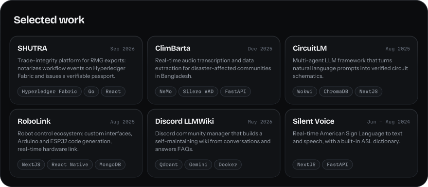
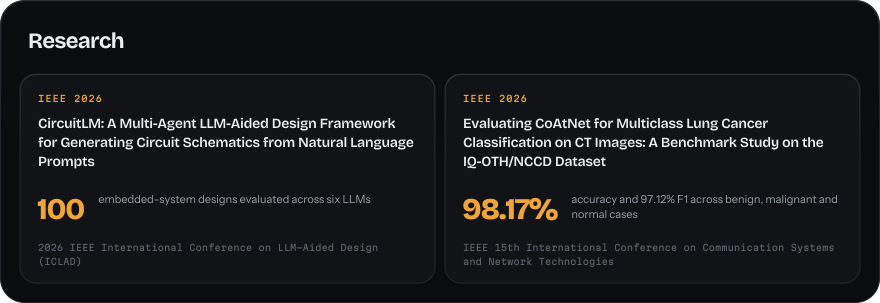

<picture>
  <source media="(max-width: 640px)" srcset="assets/m-hero.svg" />
  
</picture>

<picture>
  <source media="(max-width: 640px)" srcset="assets/m-build.svg" />
  
</picture>

<picture>
  <source media="(max-width: 640px)" srcset="assets/m-work.svg" />
  
</picture>

Public repos: [ClimBarta](https://github.com/hasin023/climbarta_prototype) / [Discord LLMWiki](https://github.com/hasin023/discord_llmwiki) / [Silent Voice](https://github.com/hasin023/sign-all_DP1)

<picture>
  <source media="(max-width: 640px)" srcset="assets/m-research.svg" />
  
</picture>

<picture>
  <source media="(max-width: 640px)" srcset="assets/m-path.svg" />
  
</picture>
