

 

<picture>
  <source media="(prefers-color-scheme: dark)" srcset="assets/h-build-dark.svg" />
  
</picture>


 

<picture>
  <source media="(prefers-color-scheme: dark)" srcset="assets/h-work-dark.svg" />
  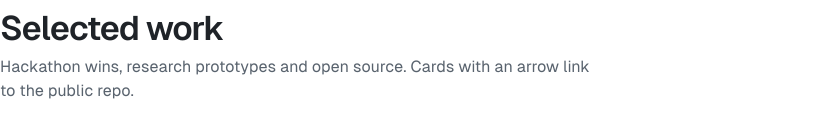
</picture>

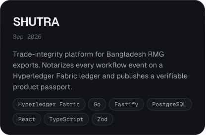
<a href="https://github.com/hasin023/climbarta_prototype">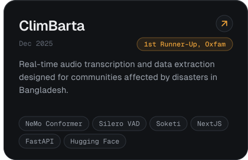</a>
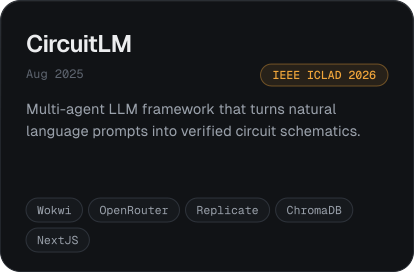
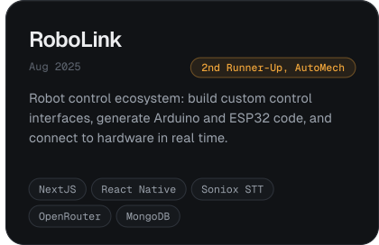
<a href="https://github.com/hasin023/discord_llmwiki">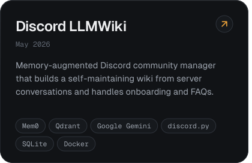</a>
<a href="https://github.com/hasin023/sign-all_DP1">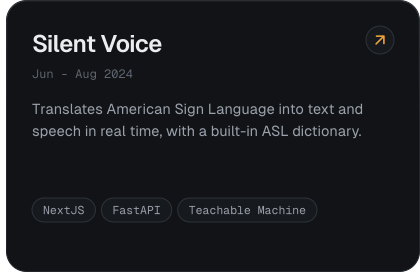</a>

 

<picture>
  <source media="(prefers-color-scheme: dark)" srcset="assets/h-research-dark.svg" />
  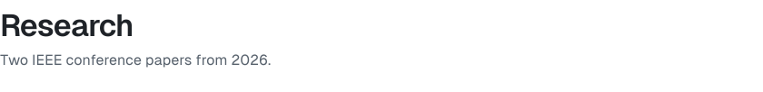
</picture>

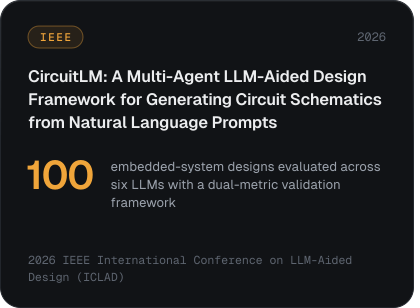
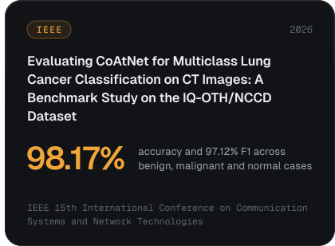

 

<picture>
  <source media="(prefers-color-scheme: dark)" srcset="assets/h-path-dark.svg" />
  
</picture>


 

<picture>
  <source media="(prefers-color-scheme: dark)" srcset="assets/h-stack-dark.svg" />
  
</picture>


 

<picture>
  <source media="(prefers-color-scheme: dark)" srcset="assets/h-activity-dark.svg" />
  
</picture>

<picture>
  <source media="(prefers-color-scheme: dark)" srcset="https://raw.githubusercontent.com/hasin023/hasin023/output/github-snake-dark.svg" />
  
</picture>

 


